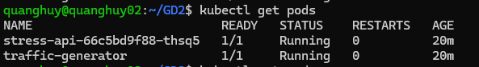
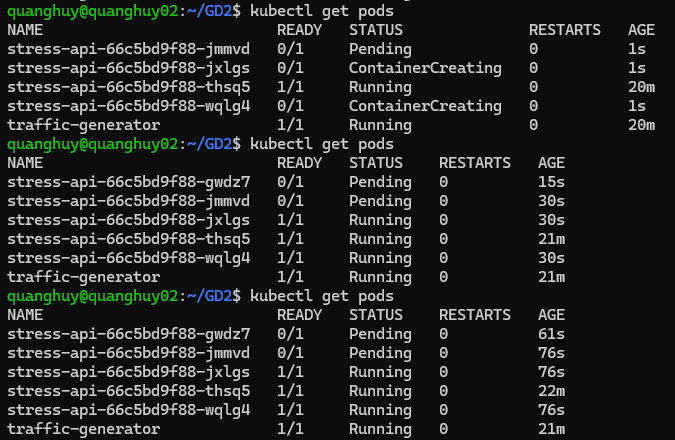
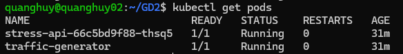
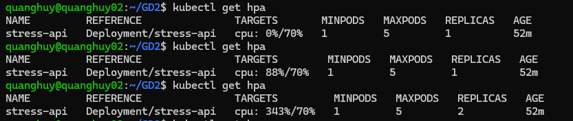
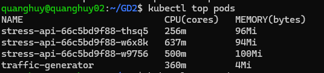
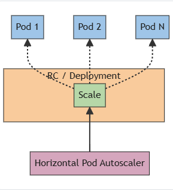
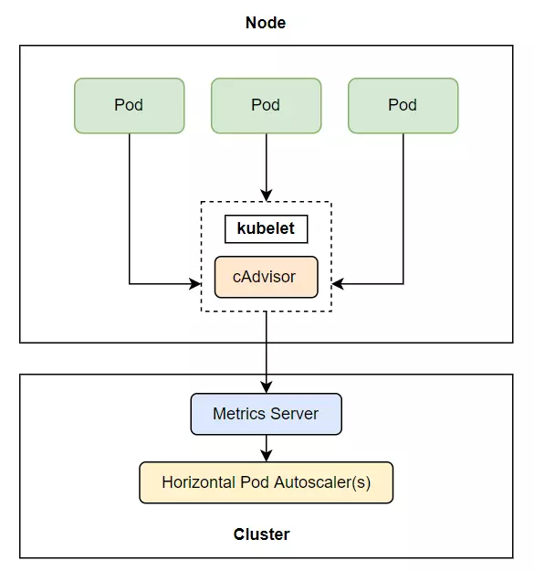
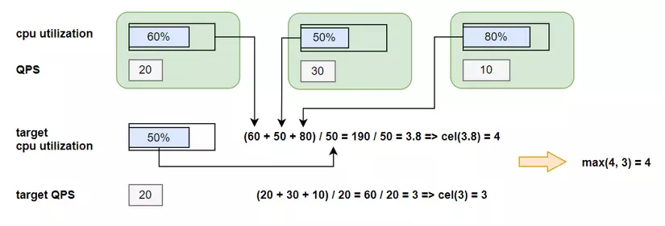

# Horizontal Pod Autoscaling

## 1. Cài đặt môi trường.
- Cài đặt Metrics Server
```sh
wget -O metrics-server.yaml https://github.com/kubernetes-sigs/metrics-server/releases/latest/download/components.yaml
```
- Chỉnh sửa trong file `metrics-server.yml`
> `kind: Deployment`

From:
```yml
containers:
    - args:
        - --cert-dir=/tmp
        - --secure-port=10250
        - --kubelet-preferred-address-types=InternalIP,ExternalIP,Hostname
        - --kubelet-use-node-status-port
        - --metric-resolution=15s
```
To:
```yml
containers:
    - args:
        - --cert-dir=/tmp
        - --secure-port=4443
        - --kubelet-preferred-address-types=InternalIP,ExternalIP,Hostname
        - --kubelet-use-node-status-port
        - --metric-resolution=15s
        - --kubelet-insecure-tls
```
From:
```yml
ports:
    - containerPort: 10250
```
To:
```yml
ports:
    - containerPort: 4443
```

Thêm 
```yml
hostNetwork: true
dnsPolicy: ClusterFirst 
```
vào cùng level của `spec/containers`

file [metrics-server](./hpa/metrics-server.yml) minh họa.


```sh
kubectl get all -l k8s-app=metrics-server -n kube-system
```

## 2. Tool stress test
- Tạo một `pod` chứa container chạy ứng dụng Flask có một endpoint `/stress`. Tiến hành gọi nhiều request tới endpoint đó và theo dõi số lượng `pod`.
```Python
from flask import request, jsonify
from __init__ import app
from prometheus_flask_exporter import PrometheusMetrics

metrics = PrometheusMetrics(app)
metrics.info('app_info', 'Application info', version='1.0.0')
metrics.register_default(
    metrics.counter(
        'by_path_counter', 'Request count by request paths',
        labels={'path': lambda: request.path}
    )
)
@app.route("/get")
def home():
    return jsonify({"123": "456"})

@app.route("/stress")
def stress():
    cnt = 0
    for i in range(500000):
        cnt += 1
    return jsonify({'cnt': cnt})

if __name__ == '__main__':
    app.run(host="0.0.0.0", port=8000, debug=False)
```
- Tạo một `pod` alpine để tạo môi trường stress test.
```yml
apiVersion: v1
kind: Pod
metadata:
  name: traffic-generator
spec:
  containers:
    - name: alpine
      image: alpine
      args:
        - sleep
        - "1000000"
```
Sử dụng container vừa tạo giả lập 5 kết nối tới `pod` với 5 luồng riêng, thời gian thực hiện 300s.
```sh
kubectl exec -it tranffic-generator -- sh
apk add wrk # benchmanrk tool
wrk -c 5 -t 5 -d 300s -H "Connection: Close" http://stress-test-service:8000/stress
```
Output:
- Trước test
<div>
    
    <p style="text-align: center">Before testing</p>
</div>
- Trong quá trình test
<div>
    
    <p style="text-align: center">During testing</p>
</div>
- Sau khi test kết thúc
<div>
    
    <p style="text-align: center">After testing</p>
</div>

- HPA
<div>
    
    <p style="text-align: center">HPA</p>
</div>
<div>
    
    <p style="text-align: center">Top pods</p>
</div>

## 3. Cách HPA hoạt động
### a. Khái niệm
- HPA: là cách scale mà ta sẽ tăng số lượng worker để xử lý công việc khi số lượng công việc tăng lên. Ở Kubernetes, HPA sẽ tăng số lượng các Pods. Kubernetes có cung cấp cho chúng ta cách autoscaling dựa vào việc phát hiện cpu hoặc memory ta chỉ định đã đạt tới ngưỡng scale.
<div style="text-align: center">
    
    <p style="text-align: center">Top pods</p>
</div>
- Horizontal pod autoscaling là cách ta tăng giá trị replicas ở trong các scalable resource (Deployment, ReplicaSet, ReplicationController, hoặc StatefulSet) để scale số lượng Pod. Công việc này được thực hiện bởi Horizontal controller khi ta tạo một HorizontalPodAutoscaler (HPA) resource. Horizontal controller sẽ thường xuyên kiểm tra metric của Pod, và tính toán số lượng pod replicas phù hợp dựa vào metric kiểm tra của Pod hiện tại với giá trị metric mà ta đã chỉ định ở trong HPA resource, sau đó sẽ thay đổi trường replicas của các scalable resource (Deployment, ReplicaSet, ReplicationController, or StatefulSet) nếu nó thấy cần thiết.

> File config của HPA

```yml
apiVersion: autoscaling/v2
kind: HorizontalPodAutoscaler
metadata:
  name: stress-api
spec:
  minReplicas: 1
  maxReplicas: 5
  metrics:
    - resource:
        name: cpu
        target:
          averageUtilization: 70
          type: Utilization
      type: Resource
  scaleTargetRef:
    apiVersion: apps/v1
    kind: Deployment
    name: stress-api
```
- Ở file trên, ta chỉ định scalable resource bằng thuộc tính `scaleTargetRef`, ta chọn resource ta muốn bằng scale là Deployment và tên của Deployment, chỉ định số lượng min và max replicas. Metric mà ta muốn thu thập **cpu** với giá trị ngưỡng 70%, khi metric thu thập được từ Pod vượt qua giá trị này, autoscale sẽ được thực thi.
### b. Quá trình Autoscaling
#### i. Thu thập metrics
- Horizontal controller thu thập metrics thông qua metrics server. Trên từng worker node có một `cAdvisor` - component của `kubelet`, có nhiệm vụ thu thập metrics, sau đó metrics này sẽ được tổng hợp ở metrics server và Horizontal controller sẽ lấy metrics từ metrics server ra.
<div>
    
    <p style="text-align: center">Cách thu thập metrics</p>
</div>

[install-metrics-server](#1-cài-đặt-môi-trường)
#### ii. Tính toán số lượng pod
- Sau khi thu thập được metrics, HPA sẽ tính toán số lượng pods dựa theo metric đã được chỉ định trong file cấu hình. 
    - `currentMetricValue`: Giá trị metric hiện tại
    - `desiredMetricValue`: Giá trị metric mà được định nghĩa trong file cấu hình.
- Số lượng replicas sẽ được tính toán theo:
```
desiredReplicas = ceil[currentReplicas * ( currentMetricValue / desiredMetricValue )]
```
- Nếu cấu hình chỉ có 1 metrics, thì số lượng Pods sẽ được tính theo công thức trên. Nếu cấu hình có nhiều metrics, horizontal controller sẽ tính giá trị replicas của từng metrics sau đó lấy **giá trị replicas lớn nhất**
<div>
    
    <p style="text-align: center">Ví dụ về nhiều metrics</p>
</div>

#### iii. Cập nhật trường replicas
- Đây là bước cuối cùng của quá trình autoscaling, horizontal controller sẽ cập nhật lại giá trị replicas của resoucre ta chỉ định trong HPA, và để resoucre đó tự động thực hiện việc tăng số lượng Pod hoặc giảm số lượng Pod. Hiện tại thì autoscaling chỉ hỗ trợ các resource sau đây:
    - Deployments
    - ReplicaSets
    - ReplicationControllers
    - StatefulSets

> Lưu ý một là khi khai báo resource muốn autoscaling được, ta phải chỉ định trường `resource`.`request` cho nó, nếu không thì resource của sẽ không thể scale được, vì nó không có ngưỡng nào để tính được desired metric cả.
```yml
metrics:
  - type: Resource
    resource:
      name: cpu
      target:
        type: Utilization
        averageUtilization: 30
```
#### iv. Scaling behavior
- **maximum rate of scaling**: Mỗi lần scale, số lượng replicas tối ta có thể scale là gấp 2 lần số lượng replicas hiện tại, còn nếu số lượng replicas hiện tại là 1 hoặc 2, thì tối đa replicas sẽ được scale là 4 replicas.
- Mỗi lần scale up cũng có thời gian giữa các lần với nhau, đối với scale up thì mỗi lần scale xong thì 3 phút sau mới trigger scale tiếp, còn đổi với scale down thì là 5 phút. 
- ở `autoscaling/v2`, chúng ta còn có thể điều chỉnh được hành vi khi scale up và scale down.
```yml
behavior:
  scaleDown:
    stabilizationWindowSeconds: 60
    policies:
    - type: Pods
      value: 4
      periodSeconds: 60
    - type: Percent
      value: 10
      periodSeconds: 60
```
- Khi scale diễn ra, nó sẽ dựa vào policies để áp dụng, mặc định là sẽ sử dụng lượng thay đổi **lớn nhất** (`selectPolicy: Max`). Ngoài ra còn có `selectPolicy: Min` giúp scale theo lượng thay đổi **nhỏ nhất**.
- `stabilizationWindowSeconds` giúp chỉ định thời gian giữa các lần scale. Mặc định là 300s.

> Default behavior của HPA
```yml
behavior:
  scaleDown:
    stabilizationWindowSeconds: 300
    policies:
    - type: Percent
      value: 100
      periodSeconds: 15
  scaleUp:
    stabilizationWindowSeconds: 0
    policies:
    - type: Percent
      value: 100
      periodSeconds: 15
    - type: Pods
      value: 4
      periodSeconds: 15
    selectPolicy: Max
```