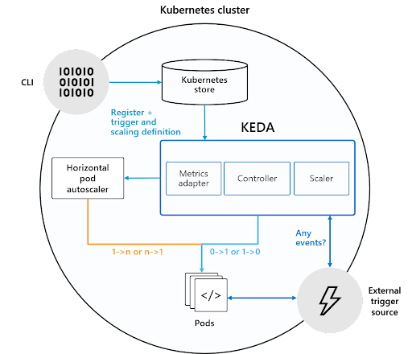
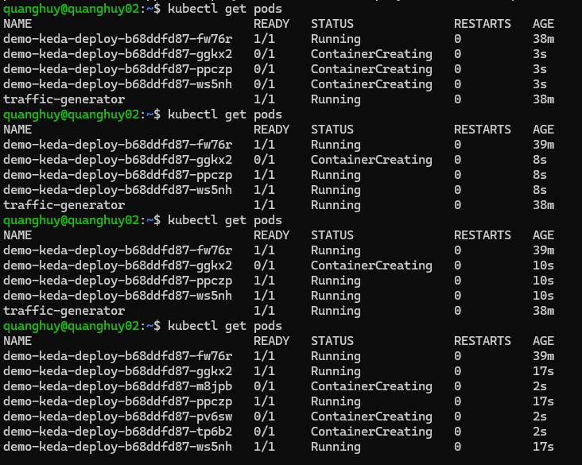

# KEDA - Kubernetes Event-drive Autoscaling
## 1. Khái niệm
- KEDA (Kubernetes-based Event-driven Autoscaling) là một thành phần mã nguồn mở được phát triển bởi Microsoft và Red Hat để cho phép bất kỳ Kubernetes workload nào được hưởng lợi từ mô hình kiến trúc event-driven. Đây là một dự án CNCF chính thức và hiện là một phần của CNCF Sandbox. KEDA hoạt động bằng cách mở rộng quy mô theo chiều ngang của Kubernetes Deployment hoặc Job. Nó được xây dựng dựa trên Kubernetes Horizontal Pod Autoscaler và cho phép người dùng tận dụng External Metrics trong Kubernetes để xác định các tiêu chí tự động điều chỉnh quy mô dựa trên thông tin từ bất kỳ nguồn event nào, chẳng hạn như độ trễ của Kafka topic, độ dài của Hàng đợi hoặc số liệu thu được từ truy vấn Prometheus.

## 2. Kiến trúc
- Ở cấp độ cao, KEDA thực hiện hai điều để thúc đẩy quá trình autoscaling:
    - Cung cấp một thành phần để kích hoạt và hủy kích hoạt Deployment để mở rộng quy mô đến và từ 0 khi không có event nào
    - Cung cấp Kubernetes Metrics Server để hiển thị dữ liệu event (ví dụ: độ dài hàng đợi, độ trễ topic)

<div>
    
    <div style="text-align: center; font-style: italic">Kiến trúc KEDA</div>
</span>

- KEDA sử dụng ba thành phần để hoàn thành nhiệm vụ của mình:
    - Scaler: Kết nối với một thành phần bên ngoài (ví dụ: Kafka) và tìm nạp các chỉ số (ví dụ: độ trễ topic)
    - Operator (Tác nhân): Chịu trách nhiệm “kích hoạt” một Deployment và tạo một đối tượng Horizontal Pod Autoscaler
    - Metrics Adapter: Trình bày các chỉ số từ các nguồn bên ngoài vào Horizontal Pod Autoscaler
### a. Scaler
- Một *Scaler* là được định nghĩa bởi *manifest* `ScaledObject`. Nó tích hợp với nguồn bên ngoài hoặc các trình kích hoạt được xác định xác định trong `ScaleObject` để tìm nạp các chỉ số cần thiết và hiển thị cho KEDA metric server.
```yml
    query: sum(rate(hello_world_requests{service="demo-keda-svc"}[1m]))
```
- KEDA Operator bao gồm một bộ điều khiển (controller) thực hiện “vòng điều chỉnh” và hoạt động như một tác nhân để kích hoạt và hủy kích hoạt một triển khai để mở rộng quy mô từ 0. Điều này được thúc đẩy bởi KEDA-operator container chạy khi bạn cài đặt KEDA.
- Nó “phản ứng” với việc tạo ra tài nguyên ScaledObject bằng cách tạo Horizontal Pod Autoscaler (HPA). Điều quan trọng cần lưu ý là KEDA chịu trách nhiệm mở rộng quy mô triển khai từ 0 thành một trường hợp và điều chỉnh nó trở lại 0 trong khi HPA đảm nhận việc tự động điều chỉnh quy mô Deployment từ đó.
- Tuy nhiên, Horizontal Pod Autoscaler cũng cần các số liệu để làm cho tính năng tự động điều chỉnh quy mô hoạt động và các số liệu lấy từ [Metrics Adaper](#b-metrics-adapter)
### b. Metrics Adapter
- Ngoài việc xác định một Custom Resource Definition và bộ điều khiển/ điều hành để hoạt động dựa trên nó, KEDA cũng triển khai và hoạt động như một máy chủ cho các chỉ số bên ngoài. Nói một cách chính xác, nó triển khai API số liệu bên ngoài Kubernetes (Kubernetes External Metrics API) và hoạt động như một “adapter” để dịch các chỉ số từ các nguồn bên ngoài sang một dạng mà người dùng Horizontal Pod Autoscaler có thể hiểu và sử dụng để thúc đẩy quá trình autoscaling.

## 3. Cài đặt KEDA
- Cài đặt prometheus [here](./setup/prometheus-setup.sh)
> File cài đặt service và deployment
```yml
apiVersion: v1
kind: Service
metadata:
  name: demo-keda-svc
  annotations:
    prometheus.io/path: "/metrics"
    prometheus.io/port: "3000"
    prometheus.io/scrape: "true"
spec:
  type: ClusterIP
  ports:
    - name: http
      port: 3000
      targetPort: 3000
  selector:
    app: demo-keda
---

apiVersion: apps/v1
kind: Deployment
metadata:
  name: demo-keda-deploy
spec:
  selector:
    matchLabels:
      app: demo-keda
  template:
    metadata:
      labels:
        app: demo-keda
    spec:
      containers:
      - name: demo-keda
        image: tota6969/nodejs-prom-http:latest
        imagePullPolicy: Always
```
> File cài đặt scaledObject
```yml
apiVersion: keda.sh/v1alpha1
kind: ScaledObject
metadata:
  name: prometheus-scale
  namespace: default
spec:
  scaleTargetRef:
    apiVersion: apps/v1
    name: demo-keda-deploy
    kind: Deployment
  minReplicaCount: 1
  maxReplicaCount: 10
  triggers:
  - type: prometheus
    metadata:
      serverAddress: http://prometheus-server.monitoring.svc.cluster.local:80/
      metricName: total_http_request
      threshold: '10'
      query: sum(rate(hello_world_requests{service="demo-keda-svc"}[1m]))
      ignoreNullValues: "true"
```
- Metrics lấy từ pod `demo-keda` và tính tổng số lượng request tới service trong 1 phút.

output khi thực hiện stress test với KEDA:
<div>
    
    <div style="text-align: center; font-style: italic">Autoscaling KEDA</div>
</span>