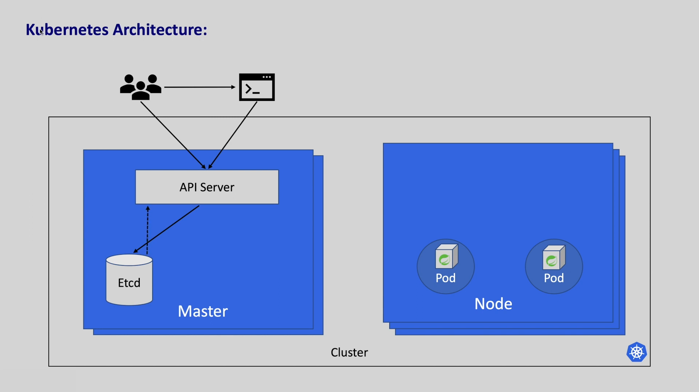

# Kubernetes (K8S)
## 1. Kubernetes
- Kubernetes là một nền tảng mã nguồn mở, khả chuyển, có thể mở rộng để quản lý ứng dụng được đóng gói và các service, giúp thuận lợi cho việc cấu hình tự động hóa việc triển khai ứng dụng.
> Kubernetes theo tiếng Hi Lap có nghĩa là `người lái tàu`.
### a. Container
|  | 
|:--:| 
| *VM and Container* |
- VM (Virtual Machine), máy ảo là một môi trường tính toán mà độc lập với chính CPU, bộ nhớ, card mạng và được tạo từ một nhóm các tài nguyên phần cứng. Và được giám sát và cô lập những nguồn tài nguyên đó bởi `hypervisor`.  Một máy tính vật lý (host) có thể có nhiều máy ảo, các máy ảo dùng tài nguyên trên host đó để vận hành, các máy ảo trên cùng một host có thể có các hệ điều hành khác nhau. Ảo hóa cho phép sử dụng tốt hơn các tài nguyên trong một máy chủ vật lý và cho phép khả năng mở rộng tốt hơn vì một ứng dụng có thể được thêm hoặc cập nhật dễ dàng, giảm chi phí phần cứng và hơn thế nữa. Với ảo hóa, bạn có thể có một tập hợp các tài nguyên vật lý dưới dạng một cụm các máy ảo sẵn dùng. 
- Container: Các container tương tự như VM nhưng chúng có tính cô lập để chia sẻ hệ điều hành giữa các ứng dụng. Do đó, container được coi là nhẹ (lightweight). Tương tự như VM, một container có hệ thống tệp, CPU, bộ nhớ, process space, vv. Khi chúng được tách rời khỏi hạ tầng bên dưới, chúng có thể khả chuyển (portable) trên cloud hoặc các bản phân phối hệ điều hành.
Ưu điểm của container:
- Khả năng thích hợp với phương pháp phát triển phần mềm Agile.
- Thích hợp phát triển, tích hợp và triển khai liên tục.
- Phân biệt Dev và Ops: tạo ra các./../images tại thời điểm build/release thay vì phải triển khai.
- Khả năng quan sát (monitoring) không chỉ metric hệ điều hành mà còn application health và các tín hiệu khác.
- Nhất quán môi trường phát triển: dev, test, prod
- Tính khả chuyển (portable)
- Phù hợp với Microservice: Phân nhỏ các thành phần nhỏ hơn, quản lý và triển khai linh hoạt.
- Cô lập các tài nguyên, sử dụng tài nguyên hiệu quả.
### b. Lợi ích của Kubernetes
- Service discovery và cân bằng tải: Kubernetes có thể expose một DNS hoặc một địa chỉ IP riêng. Cân bằng tải hoặc điều lưu lượng mạng nếu traffic truy cập đến 1 container cao.
- Điều phối bộ nhớ: Kubernetes cho phép tự động mount hệ thống lưu trữ (local storage, public cloud provider)
- Tự động rollouts và rollbacks: Người dùng có thể mô tả trạng thái mong muốn cho các container được triển khai và có thể thay đổi trạng thái thực tế sang trạng thái mong muốn được kiếm soát. Ví dụ tự động hóa để tại mới container, xóa các container hiện có và áp dụng các resource của chúng vào container mới.
- Đóng gói tự động: Người dùng chỉ cần cung cấp một cluster và các node để chạy các tác vụ đóng gói và các metrics, Kubernetes có thể điều phối các container đến các node để tận dụng các resource.
- Tự phục hồi: Tự động khởi động lại các container bị lỗi, thay thế các container, xóa các container không phải hồi lại cấu hình health check và không cho các client biết đến chúng cho đến chúng sẵn sàng hoạt động.
- Quản lý cấu hình và bảo mật: Kubernetes cho phép lưu trữ và quản lý thông tin nhạy cảm, có thể triển khai và cập nhật lại secret và cấu hình ứng dụng mà không cần build lại các container image và không để lộ secret trong cấu hình stack.
## 2. Các thành phần
|  | 
|:--:| 
| *Component Overview* |
- **Cluster**: Là một tập hợp các máy làm nhiệm vụ được gọi là **node**, thường chạy các ứng dụng đã được đóng gói. Mỗi cluster có ít nhất 1 **worker node**.
- **Worker node** chứa các Pods (Pods là các thành phần của ứng dụng, mỗi pods có thể chứa nhiều container nhưng thông thường mỗi pod sẽ chứa 1 container).
- **Control plane**:  khái niệm logic bao gồm các dịch vụ quản lý và điều khiển các worker nodes và các pods trong cụm K8S. Control plane đưa ra quyết định về cluster cũng như chịu trách nhiệm về các sự kiện (Ví dụ như tạo mới pods khi số lượng replica không đủ). Các thành phần của control plane có thể nằm ở bất kì máy nào trong cụm. Tuy nhiên để dễ dàng quản lý và setup scripts thì chỉ nên cài tất cả các components vào 1 máy và không cài thêm các thành phần khác của users lên máy đó.
- **Master node**: Là khái nhiệm vật lý hoặc phần cứng, nơi các thành phần của control plane được chạy.
### a. Các thành phần của control plane
#### i. Kube-apiserver
|  | 
|:--:| 
| *API Server* |
- Kube-apiserver: API server là component mà control plane của Kubernetes exposes Kubernetes API. API server là nơi mà end user có thể tương tác với các API trực tiếp thông qua CLI hoặc SDK. Có thể gọi API server là frontend của control plane. Với API server, người dùng có thể yêu cầu Kubernetes thực hiện các lệnh: Lên lịch, lấy danh sách các pods, ...
#### ii. etcd
|  | 
|:--:| 
| *Etcd* |
- Etcd là một *kho chứa* nhất quán và độ sẵn sàng cao, lưu trữ dưới dạng *key: value*, nơi mà Kubernetes lưu trữ tất cả dữ liệu của các cluster. Chỉ có thể truy cập vào etcd thông qua API Server vì các lý do bảo mật. Etcd có cơ chế `watch API` bằng cách theo dõi liên tục các keys và gửi các update trở lại client thông qua API server.
#### iii. Scheduler
|  | 
|:--:| 
| *Scheduler* |
- Scheduler quan sát những pods mới được tạo nhưng chưa đuợc gán cho node sau đó chọn các node phù hợp và chạy các pods đó.
- Các nhân tố để sheduler đưa ra quyết định bao gồm: yêu cầu tài nguyên cá nhân và tập thể, các ràng buộc về phần cứng/phần mềm/chính sách, thông số kỹ thuật về mối quan hệ và chống mối quan hệ, vị trí dữ liệu, sự can thiệp giữa các khối lượng công việc và thời hạn. Khi một node được chọn bởi scheduler, nó sẽ thông báo cho API server.
#### iv. Kube controll manager
|  | 
|:--:| 
| *Kube controller manager* |
- Control plane chạy các tiến trình điều khiển
    - Node controller: Chịu trách nhiệm thông báo và phản hồi khi các node ngừng hoạt động.
    - Job controller: Theo dõi các đối tượng job đại diện cho các tác vụ một lần, sau đó tạo các Pod để chạy các tác vụ đó cho đến khi hoàn thành.
    - EndpointSlice controller: Điền vào các đối tượng EndpointSlice (để cung cấp liên kết giữa Dịch vụ và Pod).
    - ServiceAccount controller: Tạo ServiceAccounts mặc định cho các namespace mới.
- Controller giúp các scheduler quản lý các pods.

Tất cả các thành phần của control plane được bao gồm trong một node gọi là **master node**
### b. Các thành phần của Node
#### i. Kuber-let
|  | 
|:--:| 
| *Kuberlet* |
- Kuberlet là một agent chạy trên từng node trong các cluster. Nó chịu trách nhiệm quản lý các pods do Kubernetes tạo ra và gửi các gửi các sự kiện về trạng thái của các pods tới các master node.
#### ii. Kuber-proxy
|  | 
|:--:| 
| *Kube-proxy* |
- Kube-proxy là một network proxy chạy trên từng node trong các cụm, cài đặt các phần của Kubernetes Service. Kube-proxy duy trì các luật cho các nodes, những luật này cho phép mạng giao tiếp giữa các Pods từ các phiên network bên trong và bên ngoài cụm.
## 3. Cấu hình YML file trong K8S
### a. `apiVersion`
- `apiVersion`: Chỉ định version của API mà kubernetes sẽ dùng. Kubernetes API có nhiều phiên bản và nhóm khác nhau (core, apps, batch, etc.).
```yml
apiVersion: apps/v1
```
- ``apps/v1``: Thường dùng cho các tài nguyên như Deployment, DaemonSet, StatefulSet, etc.
- `v1`: Phiên bản API cơ bản (core API), thường được sử dụng cho Pod, Service, ConfigMap, etc.
### b. `kind`
- `kind`: xác định loại tài nguyên mà người dùng đang tạo. Các loại tài nguyên cơ bản: `Deployment`, `Service`, `ConfigMap`, ...
```yml
kind: Deployment
```
- `Deployment`: Được sử dụng để quản lý một nhóm các Pod và kiểm soát việc cập nhật, mở rộng, hoặc hủy bỏ các Pod đó.
- `Service`: Dùng để xác định một điểm cuối mạng (network endpoint) và xác định cách các Pod sẽ truy cập vào tài nguyên hoặc dịch vụ khác.
- `ConfigMap`: Được dùng để lưu trữ các cấu hình được dùng trong các tài nguyên khác.
### c. `metadata`
- `metadata`: được dùng để chứa các thông tin cơ bản về tài nguyên như tên, namespace, labels và annotations, được dùng để định danh và tổ chức tài nguyên trong K8S.
- `name`: Tên của tài nguyên, phải là duy nhất trong phạm vi namespace
- `namespace`: phân vùng nhóm logic trong cụm K8S, giúp phân tách tài nguyên giữa các nhóm người dùng hoặc ứng dụng khác nhau.
- `labels`: Cặp key-value giúp phân loại và **lựa chọn** tài nguyên. Các `label` được sử dụng với các selector để chọn tài nguyên liên quan.
- `annotation`: Chứa thông tin phụ và mô tả về tài nguyên
```yml
metadata:
    name: my-deployment
    namespace: default
    labels:
        app: my-app
    annotations:
        description: "this is my annotations"
```
### d. `spec`
- `spec`: (specification) mô tả trạng thái mong muốn mà người dùng muốn K8S xây dựng cho tài nguyên đang được chỉ định. Nội dụng `spec` thay đổi tùy vào loại tài nguyên.
> `Deployment.yml`
```yml
spec:
    replicas: 3
    selector:
        matchLabels:
            app: my-app
    template:
        metadata:
            labels:
                app: my-app
        spec:
            container:
            - name: my-container
              image: nginx
              ports:
              - containerPorts: 80
              env:
                - name: URL
                  value: "this my my env"
```
- `replicas`: Số lượng Pod mà tài nguyên này sẽ tạo.
- `selector`: Chọn các Pod có `matchLabels` khớp với các Pod có labels đã được chỉ định.
### e. `containers`
- Liệt kê các container sẽ chạy bên trong một Pod. Mỗi container được cấu hình với `name`, `image`, `ports`, `env`
```yml
containers:
  - name: nginx-container
    image: nginx
    imagePullPolicy: Always
    ports:
        - name: my-port
          containerPort: 80
```
### f. `template`
- `template`: trong `deployment`, `template` là mẫu cho các Pod mà deployment sẽ tạo ra, `template` bao gồm `metadata` và `spec` của Pod giống như định nghĩa một Pod độc lập.


```yml
apiVersion:
kind:
    metadata:
        name:
        namespace:
        labels:
            app: # or something else
spec:
    replica:
    selector:
        matchLabels:
            app: # or something else
    template:
        metadata:
            labels:
                app:  # or something else
        spec:
            containers:
              - name: 
                image:
                imagePullPolicy:
                ports:
                  - name:
                    containerPort:      
```
## 4. Command
- Tạo một workload
```sh
kubectl create deployment NAME --image=image
> kubectl create deployment nginx-depl --image=nginx
```
## x. Tài liệu tham khảo
- [Kubernetes documentations](https://kubernetes.io/vi/docs/concepts/overview/what-is-kubernetes/)
- [What is a virtual machine (VM)?](https://www.redhat.com/en/topics/virtualization/what-is-a-virtual-machine)
- [Master kubernetes](https://youtu.be/H7VrMXgf634?list=PLrMP04WSdCjrkNYSFvFeiHrfpsSVDFMDR)