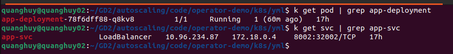
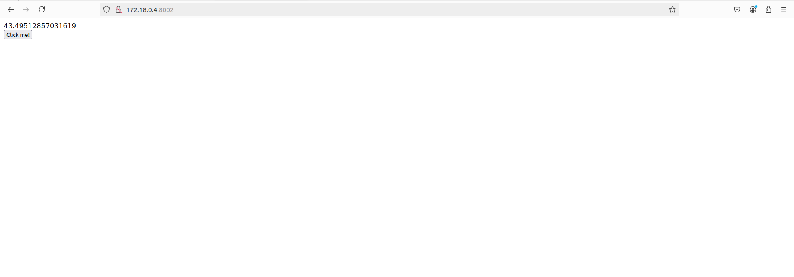
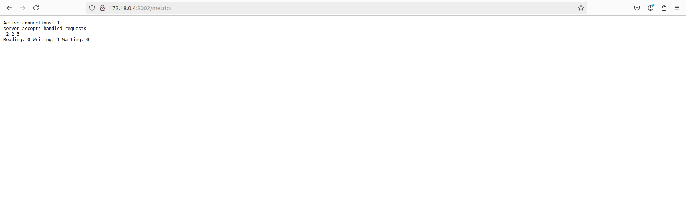

# Kubernetes Controller and Operator
## I. Kubernetes Controller
### a. Định nghĩa
- Kubernetes Controller là một vòng lặp điều khiển liên tục giám sát trạng thái hiện tại của hệ thống và so sánh với trạng thái mong muốn (được định nghĩa trong các đối tượng Kubernetes như Deployment, ReplicaSet, ...). Nếu có bất kỳ sự khác biệt nào, controller sẽ thực hiện các hành động để đưa hệ thống về trạng thái mong muốn.
### b. Chức năng:
- **Giám sát**: Theo dõi liên tục các đối tượng Kubernetes.
- **So sánh**: So sánh trạng thái hiện tại với trạng thái mong muốn.
- **Điều chỉnh**: Thực hiện các hành động để đưa hệ thống về trạng thái mong muốn (ví dụ: tạo/xóa Pod, thay đổi số lượng replica).
- Ví dụ các controller:
    - `Deployment Controller`: Quản lý số lượng replica của một ứng dụng.
    - `ReplicaSet Controller`: Quản lý số lượng Pod với nhãn nhất định.
    - `StatefulSet Controller`: Quản lý các ứng dụng có trạng thái.
...
## II. Kubernetes Operator
### a. Định nghĩa
- Kuberntes Operator là một controller tùy chỉnh, được xây dựng để tự động hóa việc triển khai, quản lý và vận hành các ứng dụng hoặc nền tảng phức tạp trên Kubernetes.
### b. Đặc điểm:
- Domain-specific: Mỗi Operator được thiết kế để quản lý một loại ứng dụng hoặc nền tảng cụ thể.
- Custom Resource Definitions (CRDs): Operator thường định nghĩa các CRD để mô tả cấu hình và trạng thái của ứng dụng mà nó quản lý.
- Automation: Tự động hóa các tác vụ phức tạp như cài đặt, nâng cấp, backup, restore.
- Ví dụ các Operator:
    - Prometheus Operator: Quản lý hệ thống giám sát Prometheus.
    - Kafka Operator: Quản lý cụm Kafka.
    - MySQL Operator: Quản lý cơ sở dữ liệu MySQL.
## III. Sự khác biệt giữa Controller và Operator
| Tính năng | Controller | Operator |
| --------- |----------- | -------- |
| Mục đích | Quản lý các đối tượng Kubernetes cốt lõi (core) | Quản lý các ứng dụng hoặc nền tảng phức tạp |
| Phạm vi |	Hạn chế trong phạm vi Kubernetes | Có thể mở rộng ra ngoài Kubernetes để quản lý các hệ thống bên ngoài |
| Độ phức tạp | Thường đơn giản hơn | Có thể rất phức tạp, tùy thuộc vào ứng dụng được quản lý |
| Khả năng tùy chỉnh |	Ít tùy biến hơn | Rất tùy biến, có thể định nghĩa các CRD và logic điều khiển tùy chỉnh

## IV. Demo Prometheus Operator (Làm lại bài cuối kì)
### a. Service và metrics
- Tạo một service HTML đơn giản, cấu hình metrics bằng nginx
```nginx
server {
    listen 80;
    server_name localhost;
    
    location / {
        root /usr/share/nginx/html/;
        index index.html index.htm;
    }
    location /metrics {
        stub_status on;
    }
}
```
### b. Cài đặt Operator: prometheus-operator
- Cài đặt prometheus vào namespace `default`
```sh
LATEST=$(curl -s https://api.github.com/repos/prometheus-operator/prometheus-operator/releases/latest | jq -cr .tag_name)
curl -sL https://github.com/prometheus-operator/prometheus-operator/releases/download/${LATEST}/bundle.yaml | kubectl create -f -
kubectl wait --for=condition=Ready pods -l  app.kubernetes.io/name=prometheus-operator -n default
```
### c. Cài đặt trên K8S
> File deployment app: `deployment.yml`
```yml
apiVersion: apps/v1
kind: Deployment
metadata:
  name: 
spec:
  replicas: 1
  selector:
    matchLabels:
      app: app
  spec:
    metadata:
      labels:
        app: app
    containers:
    - name: app
      image: quanghuy1604/vdt-operator-demo
      ports:
      - containerPort: 80
```
> File service cho app: `service.yml`
```yml
apiVersion: v1
kind: Service
metadata:
  name: app-svc
  labels:
    app: app
spec:
  type: LoadBalancer
  selector:
    app: app
    ports:
    - port: 8002
      targetPort: 80
      protocol: TCP
```



- Tuy nhiên prometheus chưa hiểu được metrics này, cần convert lại cho promethes hiểu sử dụng `nginx-prometheus-exporter`
> File cấu hình `nginx-exporter`
```yml
apiVersion: apps/v1
kind: Deployment
metadata:
  name: nginx-exporter
  labels:
    app: nginx-exporter
spec:
  replicas: 1
  selector:
    matchLabels:
      app: nginx-exporter
  template:
    metadata:
      labels:
        app: nginx-exporter
    spec:
      containers:
      - name: nginx-exporter
        image: nginx/nginx-prometheus-exporter:1.3.0
        args:
        - "-nginx.scrape-uri"
        - "http://app-svc:80/metrics"
        ports:
        - containerPort: 9113
---
apiVersion: v1
kind: Service
metadata:
  name: nginx-exporter
  labels:
    app: nginx-exporter
spec:
  type: LoadBalancer
  selector:
    app: nginx-exporter
  ports:
  - name: nginx-exporter-port
    port: 9113
    targetPort: 9113
    protocol: TCP

```
> File Service Monitor `servicemonitor.yml`
```yml
apiVersion: monitoring.coreos.com/v1
kind: ServiceMonitor
metadata:
  name: app-monitor
  labels:
    app: app-monitor
spec:
  selector:
    matchLabels:
      app: nginx-exporter
  endpoints:
  - port: nginx-exporter-port
    interval: 15s
```
> File cấu hình RBAC (Role Base Access Control) `rbac.yml`
```yml
apiVersion: v1
kind: ServiceAccount
metadata:
  name: prometheus
---
apiVersion: rbac.authorization.k8s.io/v1
kind: ClusterRole
metadata:
  name: prometheus
rules:
- apiGroups: [""]
  resources:
  - nodes
  - nodes/metrics
  - services
  - endpoints
  - pods
  verbs: ["get", "list", "watch"]
- apiGroups: [""]
  resources:
  - configmaps
  verbs: ["get"]
- apiGroups:
  - discovery.k8s.io
  resources:
  - endpointslices
  verbs: ["get", "list", "watch"]
- apiGroups:
  - networking.k8s.io
  resources:
  - ingresses
  verbs: ["get", "list", "watch"]
- nonResourceURLs: ["/metrics"]
  verbs: ["get"]
---
apiVersion: rbac.authorization.k8s.io/v1
kind: ClusterRoleBinding
metadata:
  name: prometheus
roleRef:
  apiGroup: rbac.authorization.k8s.io
  kind: ClusterRole
  name: prometheus
subjects:
- kind: ServiceAccount
  name: prometheus
  namespace: default
```
- File triển khai prometheus
```yml
apiVersion: monitoring.coreos.com/v1
kind: Prometheus
metadata:
  name: prometheus
spec:
  serviceAccountName: prometheus
  serviceMonitorSelector:
    matchLabels:
      app: app-monitor
  resources:
    requests:
      memory: 400Mi
  enableAdminAPI: false
---
apiVersion: v1
kind: Service
metadata:
  name: prometheus
spec:
  type: LoadBalancer
  ports:
  - name: web
    port: 9090
    protocol: TCP
    targetPort: 9090
  selector:
    prometheus: prometheus
```