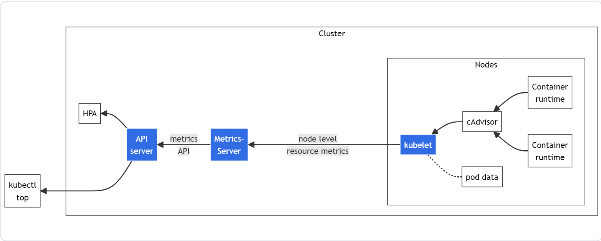

# Cách Kubernetes thu thập metrics
## 1. Quản lý các tài nguyên trong pods và containers
### a. Request và limits
Nếu một pod đang chạy trong một node có đủ tài nguyên, container có thể dùng nhiều hơn `requests` mà được chỉ định từ trước nhưng không được cho phép được dùng nhiều hơn `limits`.
- Ví dụ: nếu đặt `request` bộ nhớ là 256 MiB cho một vùng chứa và vùng chứa đó nằm trong Pod được lên tạo trong ndoe có bộ nhớ 8GiB và không có Pod nào khác thì vùng chứa có thể cố gắng sử dụng nhiều RAM hơn.
- Tuy nhiên nếu set memory `limits` cho container là 4GiB, kubelet sẽ ngăn chặn container đó sử dụng nhiều tài nguyên hơn limits đã đặt ra. Nếu container cố gắng tiêu thụ nhiều hơn tài nguyên đã đặt ra, system kernel sẽ hủy tiến trình đó và ném ra một lỗi tràn bộ nhớ (Out of memory).
> Mặc dù chỉ có thể chỉ định `requests` và `limits` cho từng container, chúng ta nên tốt hơn tính về chỉ định request/limits cho các pod bằng cách tổng hợp các thông số trên ở các containers.
### b. Đơn vị của các tài nguyêm
#### i. Đơn vị của CPU
- Limits và requests của CPU được tính bằng cpu units. Một CPU unit tương ứng với 1 core của CPU vật lý hoặc 1 core ảo, tùy thuộc vào node đang chạy trên máy ảo hay máy vật lý. 
- CPU resource luôn luôn phải chỉ định là một số tuyệt đối và không bao giờ tương đối. Ví dụ `500m` CPU sẽ giống nhau trên máy 1-core, 2-core hoặc 48-core...
> `1` CPU = `1000m` CPU. Kubernetes không chi phép CPU resource nhỏ hơn `1m` hoặc `0.001` CPU.
#### ii. Đơn vị của memory
- Limits và requests của memory được đo bằng `byte`. 
```
128974848, 129e6, 129M,  128974848000m, 123Mi
```
Chỉ định Requests và limits của cpu và memory
```yml
spec:
    containers:
        - name:
          image:
          # many other
          resources:
            request:
                cpu: "100m"
                memory: "10MiB"
            limits:
                cpu: "200m"
                memory: "20MiB"
```
## 2. Các loại metrics
Trong Kubernetes, metrics được chia thành 3 loại:
- Resource metrics:
- Custom metrics: 
- External metrics: 
## 3. Resource Metrics
- Là những metrics được thu thập từ các tài nguyên của Kubernetes như CPU, bộ nhớ (memory), và network I/O.
<div>
    
    <div style="font-style: italic; text-align: center">Resoirce metrics Pipeline</div>
</div>

- `cAdvisor`: Là một tiến trình chạy ngầm để thu thập, tổng hợp và xuất các metrics từ các container cho `kubelet`.
- `kubelet`: là một Node Agent quản lý các tài nguyên của các node. Truy cập vào các metrics thông qua `metrics/resource` và `/stats` tại kubelet endpoint.
- `Node level resource metrics`: API cung cấp bởi kubelet cho việc lấy các các số liệu thống kê theo theo các node thông qua `/metrics/resource`.
- `metrics-server`: Là một component được thêm vào trong cụm để tổng hợp các `resource metrics` được kéo về từ các kubelet. API server cung cấp các API metrics cho HPA và VPA và `kubectl top` command. Metrics Server là một implementation của Metrics API.
- `metrics API`: Kubernetes API hỗ trợ truy cập vào CPU và bộ nhớ đã sử dụng để autoscaling các workload, để có thể autoscale thì cần API extenstion server cung cấp các Metrics API.
## 3. Custom Metrics
- Là những metrics được định nghĩa và thu thập **từ bên trong ứng dụng hoặc dịch vụ** cụ thể đã được triển khai.
- Công cụ: Được thu thập thông qua các hệ thống như Prometheus. HPA có thể được cấu hình để sử dụng custom metrics.
- Sử dụng: Thường dùng để tự động mở rộng ứng dụng dựa trên các metrics tùy chỉnh mà bạn quan tâm.
- Ví dụ: Số lượng yêu cầu HTTP trong hàng đợi của một dịch vụ.
## 4. External Metrics
- Nguồn thu thập: Các metrics này đến **từ các dịch vụ hoặc nguồn bên ngoài Kubernetes**.
- Công cụ: Cần các bộ điều khiển (adapters) để tích hợp các external metrics vào Kubernetes, ví dụ như thông qua Prometheus Adapter.
- Sử dụng: HPA có thể mở rộng hoặc thu nhỏ pods dựa trên các chỉ số từ bên ngoài hệ thống.
- Ví dụ: Số lượng thông báo trong một hàng đợi message queue (như AWS SQS), hoặc độ trễ của một API bên ngoài.