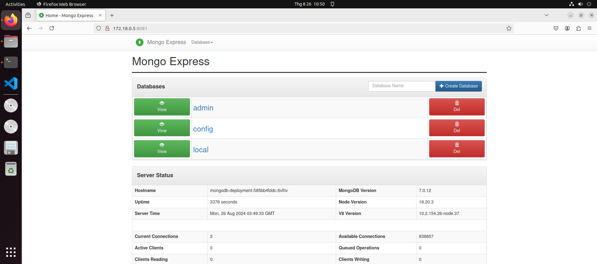

# kind
## I. Install Kind
```sh
# For AMD64 / x86_64
[ $(uname -m) = x86_64 ] && curl -Lo ./kind https://kind.sigs.k8s.io/dl/v0.23.0/kind-linux-amd64
# For ARM64
[ $(uname -m) = aarch64 ] && curl -Lo ./kind https://kind.sigs.k8s.io/dl/v0.23.0/kind-linux-arm64
chmod +x ./kind
sudo mv ./kind /usr/local/bin/kind
```
[`Bash-file`](../../code/setup/kind-setup.sh)
## II. Create Cluster
```sh
kind create cluster --name=dev
```
- Tạo cluster có nhiều node:
```yml
kind create cluster --config multi-nodes.yml --name dev
```
Với `multi-nodes.yml`
```yml
kind: Cluster
apiVersion: kind.x-k8s.io/v1alpha4
- role: control-plane
  kubeadmConfigPatches:
  - |
    kind: InitConfiguration
    nodeRegistration:
      kubeletExtraArgs:
        node-labels: "ingress-ready=true"    
  extraPortMappings:
  - containerPort: 80
    hostPort: 80
    protocol: TCP
  - containerPort: 443
    hostPort: 443
    protocol: TCP
- role: worker
```

In order to interact with a specific cluster, you only need to specify the cluster name as a context in kubectl:
```sh
kubectl cluster-info --context kind-kind
kubectl cluster-info --context kind-kind-2
```
- Lấy danh sách context hiện có
```
kubectl config get-contexts
```
- Chuyển giữa các cluster
```
kubectl config use-context <context-name>
```
## III. Cloud provider for KIND
- Vì KIND (Kubernetes IN Docker) nên các port của Cluster sẽ không được expose ra ngoài. Chúng ta muốn truy cập các port từ host thì cần expose. Có 2 cách để làm việc này:
- Sử dụng `extraPortMappings` khi tạo cụm: [Example](./hpa/init-cluster.yml)
```yml
  extraPortMappings:
  - containerPort: 80
    hostPort: 80
    protocol: TCP
  - containerPort: 443
    hostPort: 443
    protocol: TCP
```
Tuy nhiên với cách này bất tiện ở chỗ mỗi khi chúng ta muốn expose một port mới dạng NodePort thì cần tạo lại Cluster.
- Sử dụng `Cloud-provider-for-KIND`, nó sẽ chạy như một dịch vụ provider của các Cloud hiện này. Với mỗi một service dạng `LoadBanlancer` ở trong cụm sẽ được cấp phát 1 external IP và có thể kết nối từ host
- Cài đặt [](./setup/cloud-provider-KIND.sh)
- Muốn chạy dịch vụ này cần giữ cho nó chạy liên tục, chúng ta có thể để nó chạy dưới dạng 1 dịch vụ và bật tắt dễ dàng
> /etc/systemd/system/cloud-provider-kind.service
```
[Unit]
Description = LoadBalancer for KIND clusters
After = docker.service

[Service]
Type = simple
ExecStart = /home/quanghuy/go/bin/cloud-provider-kind    # change your path
StandardOutput = journal
User = 1000    # find your uid, run: id -u
Group = 1000   # find your gid, run: id -g 

[Install]
WantedBy=multi-user.target
```
> Nếu gặp lỗi `217/USER1` có thể xóa User và Group đi (để với quyền sudo)
- Khởi chạy dịch vụ
```sh
sudo systemctl enable --now cloud-provider-kind.service
```
- Kiếm tra dịch vụ
```sh
systemctl status cloud-provider-kind.service
```
- Khi đó, mỗi một service trong Cluster sẽ được cập một external service và có thể truy cập từ host
```sh
quanghuy@quanghuy02:~/GD2/autoscaling$ kubectl get svc
NAME                    TYPE           CLUSTER-IP      EXTERNAL-IP   PORT(S)          AGE
kubernetes              ClusterIP      10.96.0.1       <none>        443/TCP          4d
mongo-express-service   LoadBalancer   10.96.72.41     172.18.0.5    8081:30000/TCP   3d15h
mongodb-service         ClusterIP      10.96.225.188   <none>        27017/TCP        3d16h
```
- GUI khi truy cập từ host

