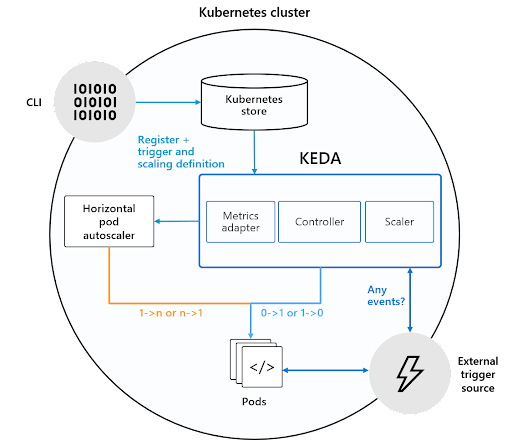

# KEDA chuyển đổi metrics

    
    
Kiến trúc hệ thống

## I. Kubernetes Store:
- Đây là nơi lưu trữ cấu hình, tài nguyên và trạng thái của Kubernetes, bao gồm các thông tin về pods, services, và các định nghĩa scaling mà KEDA sử dụng.
- Trong sơ đồ, KEDA đăng ký trigger và định nghĩa scaling trong Kubernetes store. Điều này có nghĩa là các sự kiện hoặc metrics được sử dụng để kích hoạt việc autoscaling được lưu trữ trong hệ thống của Kubernetes.
## II. KEDA:
- `Metrics Adapter`: Đây là thành phần giúp KEDA tương tác với HPA bằng cách cung cấp custom metrics. Nó chuyển đổi sự kiện hoặc dữ liệu từ các nguồn ngoài thành metrics mà HPA có thể sử dụng. Adapter này chịu trách nhiệm đưa những thông tin từ các nguồn sự kiện (như hệ thống nhắn tin, queues) đến HPA để thực hiện quá trình autoscaling.
- `Controller`: Đây là thành phần chịu trách nhiệm giám sát các nguồn sự kiện hoặc metrics và quyết định khi nào cần kích hoạt hành động scaling. Controller sẽ kiểm tra các điều kiện dựa trên sự kiện (event-based) hoặc metric để gửi tín hiệu đến scaler khi cần scale.
- `Scaler`: Khi có sự kiện xảy ra hoặc khi một ngưỡng nhất định được đáp ứng, scaler sẽ điều chỉnh số lượng pods (tăng hoặc giảm) dựa trên các trigger đã được định nghĩa trong hệ thống KEDA.

## III. Horizontal Pod Autoscaler (HPA):
- HPA là thành phần của Kubernetes có nhiệm vụ điều chỉnh số lượng replicas của các pods dựa trên các metrics như CPU, RAM, hoặc các custom metrics. Trong sơ đồ, HPA sử dụng thông tin từ Metrics Adapter của KEDA để thực hiện việc scaling.
- HPA có thể thực hiện scaling theo tỷ lệ 1 (từ một pod tới nhiều pods) hoặc ngược lại, tùy thuộc vào yêu cầu.
## IV. Events:
- Biểu tượng tia sét đại diện cho các sự kiện hoặc trigger mà KEDA lắng nghe. Những sự kiện này có thể đến từ nhiều nguồn khác nhau, chẳng hạn như hệ thống message queue (như Kafka, RabbitMQ) hoặc dịch vụ event-driven (như Azure Event Hub).
- KEDA liên tục theo dõi các sự kiện này để quyết định khi nào cần thay đổi số lượng pods.
## V. Pods:
- Các pods là nơi các container của ứng dụng chạy. KEDA và HPA sẽ điều chỉnh số lượng pods dựa trên các sự kiện hoặc metrics để đảm bảo ứng dụng có thể xử lý tải hiệu quả nhất.
- KEDA có khả năng scale từ 0 -> n hoặc 1 -> n tùy thuộc vào tải hiện tại, và sẽ khởi tạo hoặc loại bỏ pods nếu cần thiết.
## VI. Quy trình hoạt động:
- KEDA đăng ký các sự kiện và định nghĩa scaling trong Kubernetes store.
- Khi một sự kiện hoặc trigger xảy ra, controller của KEDA nhận biết và kiểm tra điều kiện. Nếu điều kiện phù hợp, controller sẽ thông báo scaler để điều chỉnh số lượng pods.
- Metrics Adapter trong KEDA cung cấp các metrics cho HPA, giúp HPA điều chỉnh số lượng pods theo mức tải hiện tại.
- HPA sau đó sẽ thực hiện các hành động scaling, tăng hoặc giảm số lượng pods dựa trên các metrics mà nó nhận được từ KEDA.
